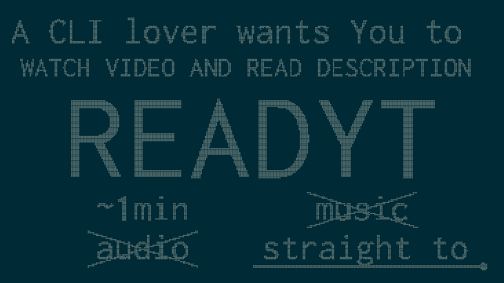

==========
``READYT``
==========

This repository has everything I want to put into my YouTube_ About_ page, which unfortunately has characters limit and can't really have good formatting. This is not only serving as ``README``, also for logs and communications as alternative comment place.

.. _YouTube: https://www.youtube.com/user/livibetter
.. _About: https://www.youtube.com/user/livibetter/about

I'm a command-line (CLI) lover, so expecting most of videos are recordings of terminal window, but I do more than that.

If you know any good programs or have ideas for the channel, not limited to CLI, please feel free to send me any information or links using `feedback`_.

.. contents:: **Contents**
   :local:

Why ``READYT``
==============

Because you need to read the description box of my videos. My YouTube video = *video* + *description*.

About my YouTube videos
=======================

What to expect
--------------

Mostly short, but not tutorials, almost all without audio tracks, no horrible music, no terribly unnecessary transitioning texts. Go straight to the points of what I want to show you about a program.

There will be description about my thoughts, possibly some short notes about controls or command-line options. My video includes the description, video and description together are the whole video, so be sure to read the description.

In the end of description, links and information about version, programming languages and major dependencies or libraries, the author(s), and the license.

Why do I make videos
--------------------

There were times that I went to a project's web page and couldn't figure out what a program would look like, does it even have UI? If I was lucky, I would at least get a screenshot.

So, quick videos to let you see what you might get are the whole idea.

How long and how many?
----------------------

Many are less than one minute, and I would probably upload two a day or even less. But don't count on that, if there is a reason to have ten, then I will upload that many.

More than videos?
-----------------

`My blog`_ is sort of text version of my YouTube channel, I will blog about programs there, but I'd not blog and make video for same subject, unless it's really necessary.

.. _My blog: http://blog.yjl.im

If it's better to introduce using video, then YouTube is. If it's better using text, then my blog. You could `subscribe to the blog`__ for updates.

__ http://blog.yjl.im/p/about.html#subscription

Issues
======

Logging
-------

When I find an *okay* project, I will open an issue, track, and plan how I can make a video of it. The issue would not be a replacement of YouTube video description box, although I will use it especially for the invalid characters ``<>`` or any codes.

But I employ the similar fashion to log things would be in the description box, such as versions, dates, notes, errors, authors, licenses, etc.

Labeling
--------

``type-*``:
  Like some categories of my playlist, they are:

  * ``type-Terminal``
  * ``type-Web``
  * ``type-X-Window``

``os-*``
  The operating systems.

``lang-*``
  The programming language is written in.

``with-*``
  Important required libraries. For instances, ``with-ncurses``, ``with-QT``, ``with-GTK+``, or ``with-SDL``, they could tell you a lot about the project.

``status-*``
  The result of the issue. It could be

  ``status-waiting``:
    Could be some bugs need to be fixed before I could actually make a video, pull requests need to be merged, or whatever reason I need to wait for something to happen.

  ``status-recorded``:
    A video is made and there shall be a link to the video.

  ``status-blogged``:
    A blog post is written for the issue.

  ``status-binned``:
    Nothing is done future, I probably don't thing it's good idea to make a video or write a post. This could happen a lot, but it doesn't necessarily mean the projects are bad.

FAQ
===

What's the font?
----------------

It's `Envy Code R`_ Preview #7.2 by Damien Guard.

.. _Envy Code R: http://damieng.com/blog/tag/envy-code-r

Feedback
========

There are a few ways to give me your feedback or ask me questions:

* YouTube Discussion_ tab
* `General Discussions`_ Issue
* Other contact_ methods
* `Open an issue`_: comments, suggestions, or questions are all welcome

.. _Discussion: https://www.youtube.com/user/livibetter/discussion
.. _General Discussions: https://github.com/livibetter/READYT/issues/1
.. _contact: http://s.yjl.im/contact
.. _Open an issue: CONTRIBUTING.rst

Copyright
=========

The contents in Git repository has been placed in the public domain via the Unlicense_.

.. _Unlicense: UNLICENSE
